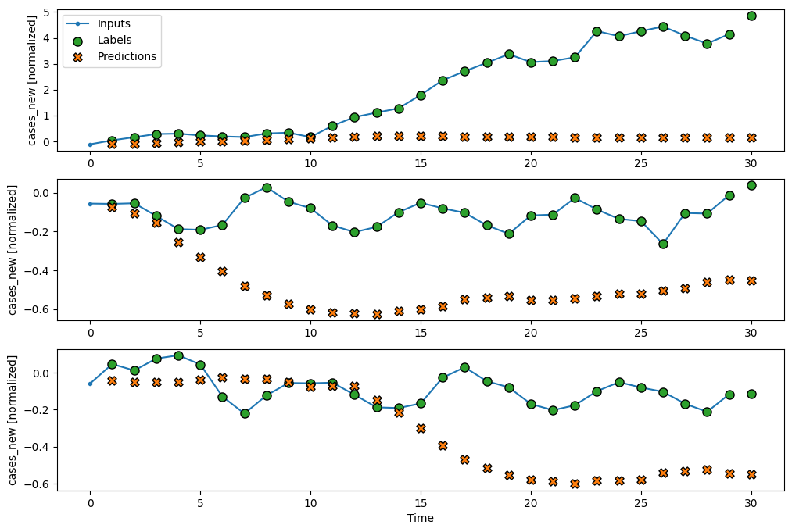
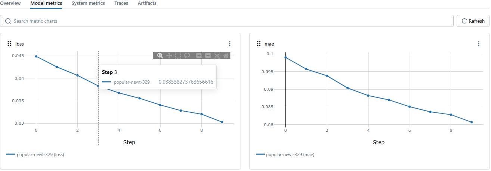
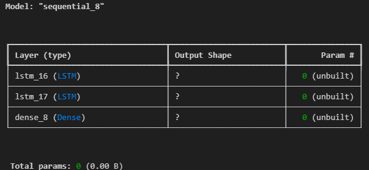

# MyProject
About Project
This project aims to predict daily COVID-19 cases in Malaysia using a Recurrent Neural Network (RNN) model with Long Short-Term Memory (LSTM) layers. The model is trained on historical COVID-19 case data and optimized to minimize prediction error.

The dataset is sourced from Malaysia's COVID-19 data and consists of:

cases_malaysia_train.csv – Training dataset containing historical case records.
cases_malaysia_test.csv – Testing dataset for model evaluation.

The data undergoes the following preprocessing steps:
Handling missing values
Converting cases_new to numeric format
Normalizing numerical features
Creating time-series windows for LSTM training

### Prediction vs Actual Cases

Here is a comparison between the predicted COVID-19 cases and the actual cases on the test dataset:

### MLflow Training Results

The following image shows the training results and metrics tracked by MLflow:

architecture

The model is trained using TensorFlow/Keras with MLflow logging.
Performance metrics:
Loss (MSE): 0.0302
Mean Absolute Error (MAE): 0.0807
The trained model is evaluated on test data using visualization tools.